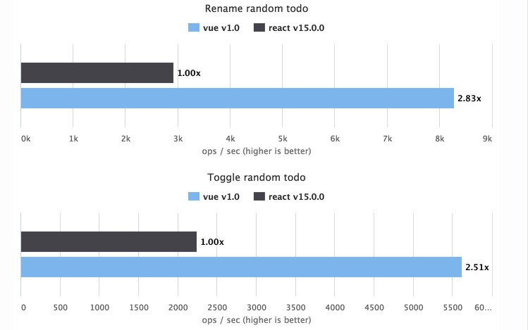
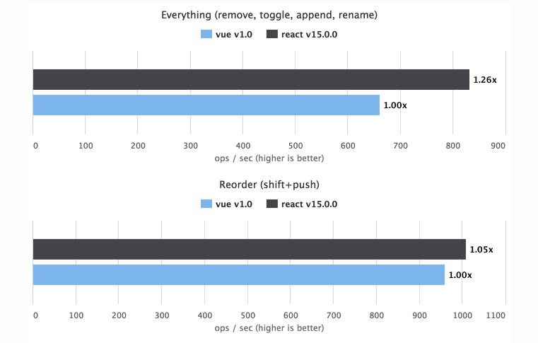

# 对比测试Reat和Vue在TODOMVC中的性能表现

## 说明 
本测试的目标是对比两种库在数据变化后的渲染性能，测试中未采用react的`shouldComponentUpdate`手动优化方案。由于Vue采用异步DOM渲染，为了便于准确地测试出数据变化的渲染效率，使用`Vue.config.async = false; `关闭了异步模式

##结论
1、在不涉及到DOM重排的数据变化测试案例中Vue性能较好

2、在频繁插入删除节点的测试案例中使用Virtual DOM技术的React性能较好

